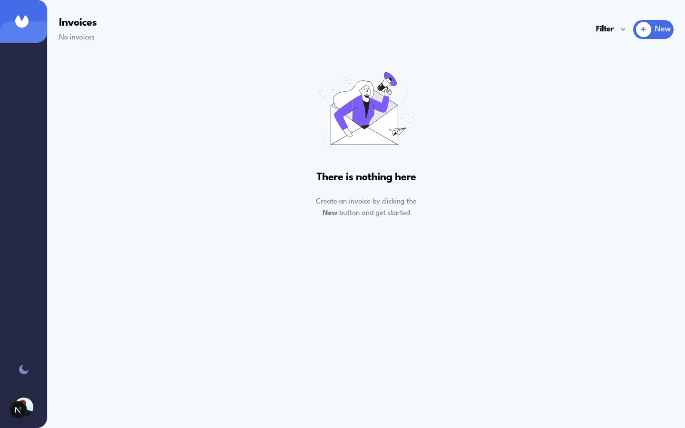

# Invoice App

Implémentation en cours du challenge [Invoice App de Frontend Mentor](https://www.frontendmentor.io/challenges/invoice-app-i7KaLTQjl), construite avec Next.js, TypeScript et tRPC.

## État du projet

Le socle full-stack et l'interface responsive sont en place. La branche actuelle contient :

- le layout mobile/desktop et la navigation latérale ;
- l'écran de liste vide, le filtre par statut et les composants d'interface ;
- un schéma relationnel pour les factures, adresses et lignes de facture ;
- les procédures tRPC de création, lecture, mise à jour, suppression et statistiques ;
- la validation Zod et les contrôles d'intégrité référentielle.

La connexion entre l'interface et ces procédures, les formulaires de facture et le thème sombre restent à finaliser. Le dépôt ne présente donc pas le challenge comme terminé.

## Capture



## Liens

- [Dépôt GitHub](https://github.com/lpreaux/invoice-app)
- [Démo Netlify du prototype](https://lpx-invoice-app.netlify.app/invoices)
- [Challenge Frontend Mentor](https://www.frontendmentor.io/challenges/invoice-app-i7KaLTQjl)

La démo reflète l'état actuel du prototype ; le parcours CRUD reste à terminer.

## Stack

- Next.js 15 et React 19 ;
- TypeScript et Tailwind CSS 4 ;
- tRPC et TanStack Query ;
- Drizzle ORM avec SingleStore ;
- Zod, ESLint et Prettier.

## Lancement local

Prérequis : Node.js 20+, pnpm et une base SingleStore accessible.

```bash
cp .env.example .env
# Renseigner les variables SINGLESTORE_* dans .env
pnpm install --frozen-lockfile
pnpm db:push
pnpm dev
```

L'application est ensuite disponible sur <http://localhost:3000/invoices>.

## Vérifications

```bash
pnpm check
pnpm format:check
pnpm build
```

## Suite prévue

- brancher la liste et les filtres sur tRPC ;
- créer les formulaires d'ajout et d'édition avec leurs validations ;
- implémenter les changements de statut et la suppression ;
- terminer le thème clair/sombre ;
- terminer le parcours CRUD avant de présenter le challenge comme finalisé.
